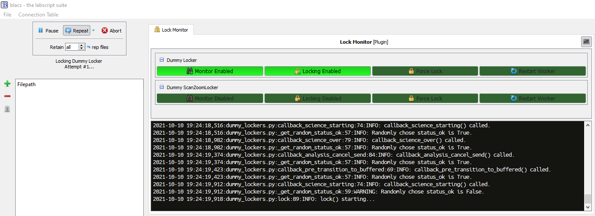

Lock Monitor
============

Introduction
------------

Lock monitor is a blacs plugin designed as a framework to help users automatically pause the blacs queue when a laser goes out of lock and optionally attempt to lock the laser automatically.
The role of lock monitor is possibly best explained by listing what is does and doesn't do.

What Lock Monitor Does:

* It calls user-written code to check if lasers are in lock at various points during the execution of a shot.
* It temporarily pauses the blacs queue and optionally calls user-written code to lock a laser when it is determined to be out of lock.
    * The queue is unpaused if the laser is successfully locked, or remains paused if the laser fails to lock after a few attempts.
* It provides a blacs tab as a GUI for controlling various lockers.
* It provides a settings interface for adding/removing lockers.
* It provides base classes for monitoring and locking lasers, which include methods that the user must flesh out.
* It sandboxes user-written code in separate worker processes to reduce the chance that bugs there can crash blacs.

What Lock Monitor Does NOT Do:

* It does NOT include code to communicate with hardware, such as function generators and oscilloscopes, as the possible variety of hardware is too large.
  The user must use 3rd party libraries and/or write the code to communicate with the required hardware themselves.
* It does NOT perform the required signal analysis.
    * In particular it does NOT identify features oscilloscope traces of spectroscopic features to determine where to lock the laser.

Although lock monitor was written with locking lasers in mind, it likely has other uses.
For example, a user could monitor the power transmitted through a fiber and pause the blacs queue if it drops below a certain level.
They could even write code to automatically realign light into the fiber if the mount has electronic actuators, which lock monitor could automatically call.

Lock monitor took inspiration from, but is distinct from, the labwatch blacs plugin.

Using Lock Monitor
------------------

This section briefly describes how lock monitor is used.
More detailed instructions and information on how to write the code required to interface lock monitor with your system are provided in other sections below.

Once the user has written their locker classes, using lock monitor is very simple.
First, lock monitor is enabled by adding the line ``lock_monitor = True`` to the ``[BLACS/plugins]`` section of the labconfig.
Instances of user-written locker classes are then added by entering their import path in the "Lock Monitor" tab of the blacs preferences menu, accessed via File -> Preferences -> Lock Monitor.
A restart of blacs is required for those changes to take effect.

When lock monitor is enabled, a blacs tab is created with the title "Lock Monitor".
The tab contains one collapsible section per locker, each one containing the controls for the given locker.
The controls include the following:

* ``Monitor Enable``: This controls whether or not the methods to check the laser's lock status are enabled.
* ``Locking Enable``: This controls whether or not lock monitor should attempt to lock the laser if it is found to be out of lock.
  If monitoring is enabled but locking is disabled and the laser is found to be out of lock, then the current shot will be aborted and requeued, and the queue will be paused.
* ``Force Lock``: When clicked, this will force lock monitor to lock the laser when the next shot is executed, regardless of whether or not the laser is deemed to be out of lock.
  Note that, as of this writing, the laser will not be locked immediately; it will be locked when the next shot is run.
  Once the locker has been forced to lock, this control will automatically be turned off again.
* ``Restart Worker``: When clicked, this will instruct lock monitor to restart the worker process for the locker.
  Restarting the worker will re-import the locker and re-run its initialization methods, which can be helpful if something goes wrong or if you've made changes to the locker's code.
  Note that, as of this writing, this will not be done immediately; the worker will be restarted when the next shot is run.
  Once the worker has begun restarting, this control will automatically be turned off again.

Approach
--------

Lock monitor works by calling methods of user-written python classes at certain points in the execution of a shot as the blacs state machine moves between states.
These methods are referred to as callbacks, as they are run when blacs executes its plugin callbacks.
Each user-written callback should return either ``True`` or ``False``.
When ``True`` is returned, blacs is allowed to continue on running the shot as usual.
However, when ``False`` is returned, the following steps are taken:

#. Lock monitor attempts to abort the shot, though the shot may continue to run if it is too late to abort.
#. The blacs queue is paused.
#. Whether or not the shot was successfully aborted, it is NOT sent to lyse and is instead prepended to the top of the blacs queue.
#. Lock monitor then calls user-written code to lock the laser if such code is provided.
#. If the lock is successful, as determined by more user-written code, the queue is then unpaused.
   If the lock is unsuccessful, a few more attempt to lock are made.
   If none of those attempts are successful, or if no automatic locking code is provided for the laser, then the queue is left in the paused state.

Put another way, the user writes callbacks which are methods of a locker class.
The callbacks should communicate with whatever hardware is necessary then return ``False`` if they determine that a laser is out of lock and ``True`` otherwise.
For automatic locking to work, the user must also write a ``lock()`` method for their class, which lock monitor will call when necessary.

Making ``Locker`` Classes
-------------------------

The ``Locker`` Class
^^^^^^^^^^^^^^^^^^^^

The code used to check and lock lasers should be organized into a locker class.
User-created locker classes should inherit from the provided ``Locker`` class which can be imported from ``blacs.plugins.lock_monitor.lockers``.
That class provides the minimum set of properties and basic methods that locker classes should have.
The class properties and methods are described in detail in the docstrings, which should be referred to when writing a custom locker class.
Briefly, the most important attributes are:

* ``self.logger`` for logging progress, results, etc. with commands such as ``self.logger.info("Doing some step...")``.
  Logging isn't strictly necessary but it is extremely helpful when debugging and so it is strongly encouraged that users add logging statements to their locker class methods.
* ``self.display_name`` which is used to label the controls, as well as a few other things.
* ``self.plot_dir`` is the suggested directory in which to save plots, which is a subdirectory of the directory specified by ``blacs.plugins.lock_monitor.lockers.LOG_PATH``, which in turn is a subdirectory of the default labscript logging directory specified by ``labscript_utils.setup_logging.LOG_PATH``.
  The subdirectory path also includes ``self.plot_root_dir_name``, as well as subdirectories for the year, month, day, and full date/time.
  As with logging, generating plots isn't strictly necessary but can be extremely helpful in debugging when things go wrong, so doing so is strongly encouraged.
* ``self.plot_root_dir_name`` is the name of a folder in the path to ``self.plot_dir``, which is created in ``blacs.plugins.lock_monitor.lockers.LOG_PATH``.
  Note that the suggested full path for where to save plots is ``self.plot_dir``, not ``self.plot_root_dir_name``.
* ``self.auto_close_figures`` is used to indicate whether or not methods should close figures after generating them.
  This isn't enforced, but should be done, so the user's code should check the value of this property and close any figures generated if it is set to ``True``.
  Generally this should be set to ``True`` when the locker class is used with lock monitor so that plots aren't left open, potentially consuming a lot of memory.
  Setting this to ``False`` can be useful though when testing/developing locker classes e.g. in a Jupyter notebook

The most important methods of the ``Locker`` class are the following:

* ``self.__init__()``: If a user writes an ``__init__()`` method for their locker class, they should make sure that it calls the ``__init__()`` method of ``Locker`` by calling ``super().__init__()``.
* ``self.init()``: Not to be confused with ``__init__()`` (note the presence/lack of double underscores), the ``init()`` method is called by lock monitor when it starts up.
  For reasons that will be apparent later on, the code included in the class's ``__init__()`` method will run when the module with the user's locker class is imported.
  It is probably not desirable to connect to hardware in the ``__init__()`` method then because then any code that imports that module will immediately open a connection to the hardware.
  To work around this, put the code to open connections to hardware in the ``init()`` method of the locker class so that it won't be called when the module is imported but it will still be run by lock monitor.
* ``self.close()``: Lock monitor will call each locker's ``close()`` method when it shuts down.
  That makes it the appropriate place to put code to disconnect from hardware and perform any other tasks that should be done when closing.
* ``callback_*``: Callback methods are the methods called as shots are run to check if the laser is in lock. See the docstring of each of those methods to determine at what point in running a shot a given callback method is executed.
    * Not all of these methods need to do anything useful; it's perfectly fine to e.g. check the lock status in one callback and have the others do nothing.
    * Each callback method should generally return ``True`` except when it detects that the laser is out of lock, in which case it should return ``False``.
      Returning ``True`` indicates to lock monitor that it should continue on as normal, while returning ``False`` will cause lock monitor to begin handling the fact that the laser is out of lock.
      Unused callbacks, or callbacks which perform some tasks but do not themselves determine whether or not the laser is locked, should just always return ``True``.
    * Keep in mind that although the order in which callbacks are run is always the same for every shot, some callbacks may be skipped.
      For example, this may happen if the shot is aborted.
      Therefore do NOT assume that every callback will run for every shot.
      It is good practice to have ``callback_pre_transition_to_buffered()``, which is the first callback run for any shot, do any clean up required if some callbacks from a previous shot were skipped, if that is necessary.
* ``lock()``: When a callback method returns ``False`` to indicate to lock monitor that the laser is out of lock, lock monitor will call the locker's ``lock()`` method.
    * If the user's locker class does not support automatic locking, then this method should simply return ``False`` which indicates to lock monitor that the laser is still not in lock.
    * If the user's locker class does support automatic locking, then the ``lock()`` method should attempt to lock the laser and return ``True`` if it succeeded or ``False`` otherwise.
      Because the code to check the lock status presumably already exists in the ``calback_*()`` methods, it is usually convenient for ``lock()`` to call one or more of those methods after attempting to lock the laser.
      As mentioned above, it is very useful for the ``lock()`` method to use ``self.logger`` to log its progress and ideally it should save plots as well, typically in the directory specified by ``self.plot_dir``.
    * Before saving any figures, ``lock()`` should call ``self.update_save_time()`` which will set a new timestamp to use when generating the year/month/day/time subdirectories in ``self.plot_dir``.

To write a custom ``MyLocker`` class, the user should create a class which inherits from ``Locker`` then override some or all of the methods mentioned above.
The methods should be written to implement the behavior described in the docstrings for the corresponding methods of the ``Locker`` class.
The code below shows a typical starting point:

.. code-block:: python

    from blacs.plugins.lock_monitor.lockers import Locker

    class MyLocker(Locker):
        def init(self):
            # Do some logging for debugging purposes.
            self.logger.info(f"init() called for {self.display_name}.")
            
            # Do any other desired setup here.

            # init() doesn't need to return anything.
            return
    
    # Create an instance of the MyLocker class which lock monitor will use. Of 
    # course make sure to provide the actual initialization arugment values.
    mylocker_instance = MyLocker(<initialization args>)

Generally it is best to start with ``init()`` and/or ``__init__()`` (make sure to call ``super().__init__()``) and use it to add the ability for the locker class to communicate with hardware.
Next, override one or more of the ``callback_*`` methods to have the locker check if the laser is in lock.
Don't forget to add some logging statements using ``self.logger`` to help with debugging!
It is not necessary to override all of the ``callback_*`` methods; just override as many as you need.
Once that is done, optionally implement a ``lock()`` method so that lock monitor can automatically lock the laser when it goes out of lock.
In addition to logging, you'll likely also want to generate some plots and save them to ``self.plot_dir``, which can be very helpful for debugging as well.
Make sure to close those plots if ``self.auto_close_figures`` is set to ``True``.

Developing the code for a ``Locker`` class can take a lot of trial and error.
For that reason it is recommended to develop that code in an interactive environment, such as a Jupyter notebook.
When doing so, it can be helpful to set ``auto_close_figures`` to ``False`` so that they appear in the notebook.

The ``ScanZoomLocker`` Class
^^^^^^^^^^^^^^^^^^^^^^^^^^^^

For convenience, lock monitor also includes a ``ScanZoomLocker`` class which inherits from ``Locker`` but includes some additional template methods for locking to a spectral feature.
Again, the user is in charge of implementing most of the methods to acquire and analyze the required data.

``ScanZoomLocker`` is designed to lock a laser in analogy with how they are often locked by hand.
Often a user sweeps the laser's frequency and observes some spectrum on an oscilloscope.
The user then looks at the oscilloscope trace and identifies the target feature that they'd like to lock to.
Once the target feature is identified, the user repeatedly reduces the amplitude of the scan and adjusts the scan's offset to center the scan around the target feature.
At some point the user often adjusts the setpoint (aka error offset) as well.
After zooming in sufficiently far, the feedback is enabled to engage the lock.
Lastly the user verifies that the laser successfully locked.

``ScanZoomLocker`` includes methods which the user fills out to perform each of those steps that are normally performed when locking a laser to s spectral feature manually.
It also includes an implementation of the ``lock()`` method to perform those steps in order.
Of course the user is free to override the ``lock()`` method as well if desired.

In addition to the attributes inherited from the ``Locker`` class, ``ScanZoomLocker`` has the following notable attributes, many of which are initialization arguments of the class:

* ``zoom_factor`` sets by what factor the scan range is shrunk by during each iteration.
* ``n_zooms`` sets the number of zooming iterations to perform before enabling the feedback loop to lock the laser.
* ``n_zooms_before_setpoint`` sets the number of zooming iterations to perform before adjusting the setpoint (aka error offset).
    * Often the target spectral feature is very narrow in the initial scan, and sometimes it is wider than the final zoom's scan range.
      In such cases, performing some of the zooming iterations before adjusting the setpoint makes it possible to examine the target feature and determine the desired setpoint.
* ``initial_scan_amplitude`` sets the amplitude of the scan used at the beginning of the first zooming iteration.
* ``initial_scan_feedforward`` sets the feedforward control value used at the beginning of the first zooming iteration.

In addition to the methods inherited from the ``Locker`` class, ``ScanZoomLocker`` locker also includes the following template methods which should be implemented by the user:

* ``check_lock()``
* ``disable_feedback()``
* ``enable_feedback()``
* ``get_feedforward()``
* ``get_lockpoint_feedforward_value()``
* ``get_lockpoint_setpoint_value()``
* ``get_scan_amplitude()``
* ``get_setpoint()``
* ``lock()``
* ``set_feedforward()``
* ``set_scan_amplitude()``
* ``set_setpoint()``
* ``zoom_in_on_lockpoint()``

For most of those methods their purpose is clear from their name.
For any that aren't clear, consult the method's docstring for a description of the method's intended behavior.
The code for the ``DummyScanZoomLocker`` class (discussed below) is also a good reference when implementing the methods required by ``ScanZoomLocker``.
The ``zoom_in_on_lockpoint()`` and ``lock()`` methods are already implemented (though the user is welcome to override them as desired), but the user must implement the other methods listed above in order for ``ScanZoomLocker.lock()`` to work.

Adding Lockers to Lock Monitor
------------------------------

Once your locker is ready for use, lock monitor must be configured to use it.
Lockers are added to lock monitor using its settings interface

To add a locker to lock monitor, follow the steps below:

#. Create a python module in which an instance of your locker class is created.
    * It's typically convenient, but not required, to create the instance of the locker class in the same module in which it is defined.
#. Next, make sure that the python module can be imported from the python interpreter.
    * When labscript is installed, the ``pythonlib`` folder in the ``userlib`` directory is added to ``PYTHONPATH``, so that can be a good place to put the module.
#. Add the instance of your locker class to lock monitor's list of lockers.
    * To do so, open blacs and select File -> Preferences then navigate to the "Lock Monitor" tab.
      Once there add the import path of your locker instance (the instance of your class, NOT the class itself!) to the table and click "OK".
#. Restart blacs for the changes to take effect.

Following from the ``MyLocker`` example above, suppose that code is included in a file ``my_locker_module.py`` which is placed in the directory ``pythonlib/lockers``.
To add that locker to lock monitor, you would add the import path ``pythonlib.lockers.my_locker_module.mylocker_instance`` in the lock monitor settings tab.
Again note that the import path ends with ``mylocker_instance`` (the instance of the class) and NOT ``MyLocker`` (the class itself).

After blacs restarts, a new collapsible tool palette should be added to the lock monitor blacs tab which contains the controls for the locker and is labeled by the display name passed during ``mylocker_instance``'s initialization.
If no such tool palette appears, see the troubleshooting section below.

For convenience, lock monitor also includes some "dummy" locker instances in ``blacs.plugins.lock_monitor.dummy_lockers`` which do not actually control any hardware but can still be added as lockers to lock monitor.
This can be useful for testing/debugging, or even just for seeing how lock monitor behaves when everything works correctly.
The ``DummyLocker`` class in that module is a simple locker which does nothing but randomly pretend to be out of lock on occasion.
It then pretends to lock simply by pausing for a few seconds.
An instance of that class can be added to lock monitor by including the import path ``blacs.plugins.lock_monitor.dummy_lockers.dummy_locker_instance`` in the settings.
The dummy locker module also includes the ``DummyScanZoomLocker`` class, which simulates using the ``ScanZoomLocker`` class.
It also randomly pretends to be out of lock on occasion.
Additionally it pretends to lock by generating simulated data of a spectroscopic signal and zooming in on a dispersive feature.
In the process it produces log messages and plots which can be seen in the log folder.
An instance of that class can be added with the import path ``blacs.plugins.lock_monitor.dummy_lockers.dummy_scan_zoom_locker_instance``.

Creating a Logger
-----------------

Due to the importance of good logging, the ``Locker`` class requires an instance of the ``logging.Logger`` class for one of its initialization arguments.
This will be straightforward for those familiar with Python's ``logging`` module, and an example of how to set up a logger is included below to help other users.
The example sets up a logger that will both print messages to console and record them to a file in labscript's default log directory.
Of course feel free to change any of the options as desired, particularly the name for the log file.

.. code-block:: python

    # Make the required imports.
    import os
    import logging
    import sys
    from blacs.plugins.lock_monitor.lockers import LOG_PATH

    # Get a logger. This is what should be passed to ``Locker`` during
    # initialization.
    logger = logging.getLogger(__name__)

    # Configure some options for the logger. In particular set it to process
    # messages of priority DEBUG or higher, and set the format of the log
    # messages so that they include a lot of helpful data such as the time, the
    # name of the file, the name of the calling function, and so on.
    logger.setLevel(logging.DEBUG)
    formatter = logging.Formatter(
        '%(asctime)s:%(filename)s:%(funcName)s:%(lineno)d:%(levelname)s: %(message)s'
    )

    # Set up a console handler, which will take the messages sent to the logger
    # and print them to the console. It is set to only do this for messages of
    # priority level INFO or higher.
    console_handler = logging.StreamHandler(sys.stdout)
    console_handler.setLevel(logging.INFO)
    console_handler.setFormatter(formatter)
    logger.addHandler(console_handler)

    # Set up file handler, which will take the messages sent to the logger and
    # record them to a log file called 'my_locker.log'. It will record messages
    # of priority DEBUG or higher. The file is opened with mode 'w' which makes
    # it overwrite any existing copy of the log file on startup.
    full_filename = os.path.join(LOG_PATH, 'my_locker.log')
    file_handler = logging.FileHandler(full_filename, mode='w')
    file_handler.setLevel(logging.DEBUG)
    file_handler.setFormatter(formatter)
    logger.addHandler(file_handler)

    # Make the first log entry.
    logger.debug('Logger configured.')

Once the logger has been configured and a locker has been instantiated with it, it is stored as the locker's ``self.logger`` attribute.
The locker can log messages from within the locker class methods as demonstrated in the example log messages below:

.. code-block:: python

    from blacs.plugins.lock_monitor.lockers import Locker

    class MyLocker(Locker):
        def init(self):
            # Logging at the debug level is good for recording tedious details
            # or small steps of progress. Python f-strings are very helpful
            # here.
            self.logger.debug("Starting some small step...")
            self.logger.debug("Finished some small step.")
            self.logger.debug("Record some very detailed information here...")

            # Logging at the info level is great for keeping track of higher-
            # level program flow and recording some useful information, such as
            # the feedback loop error signal amplitude.
            self.logger.info("Starting some series of steps...")
            self.logger.info("Finished some series of steps.")
            self.logger.info("Measured some important value to be... ")

            # Logging at the warning level is good for indicating something
            # seems wrong.
            self.logger.warning("Some signal is starting to get a bit high...")

            # Logging at the error level is good to do when things do go wrong.
            self.logger.error("Something has gone wrong; here's some info:...")

            # The logger.exception method can be used in except blocks to record
            # the traceback of the error that was caught.
            try:
                # Something that will throw an error.
                raise Exception("Throwing an error for demonstration purposes.")
            except Exception:
                # Record a message which will automatically also include the
                # exception's traceback.
                logging.exception("Caught the following exception:")

As mentioned previously, in addition to logging information it can be very helpful to save plots as well.
The example below includes a method that shows how this can be done.

.. code-block:: python

    import matplotlib.pyplot as plt
    from blacs.plugins.lock_monitor.lockers import Locker

    class MyLocker(Locker):
        def save_a_plot(self):
            # This example method assumes that some other method has stored the
            # data from an oscilloscope trace as the attribute self.scope_trace.
            # Another method, likely lock(), should probably call
            # self.update_save_time() as well so that a new plot directory is
            # created with the appropriate timestamp.

            # Create a figure and axes to plot on.
            fig = plt.figure()
            axes = fig.add_subplot(111)
            
            # Plot the data.
            axes.plot(self.scope_trace)

            # Add text information so that people know what the plot shows!
            axes.set_title("Scope Trace of...")
            axes.set_xlabel("Time (arbitrary units)")
            axes.set_ylabel("Spectroscopy Signal (Volts)")

            # Save the figure as an image. Of course feel free to change the
            # filename to something more appropriate and informative!
            filename = os.path.join(self.plot_dir, 'scope_trace.png')
            fig.savefig(filename)

            # Lastly, remember to close the figure if configured to do so!
            if self.auto_close_figures:
                plt.close(fig)

Tips
----

Below are some tips for setting up and using lock monitor:

* Test out the dummy lockers included with lock monitor to get a sense of what it's like to use lock monitor before writing any code yourself.
    * The dummy lockers don't control any real hardware but can be added to lock monitor for testing/debugging purposes.
    * The dummy locker can be added by including the import path ``blacs.plugins.lock_monitor.dummy_lockers.dummy_locker_instance`` in the lock monitor settings menu.
    * Similarly the dummy scan/zoom locker can be added by including ``blacs.plugins.lock_monitor.dummy_lockers.dummy_scan_zoom_locker_instance``.
    * Once you are done playing around with the dummy lockers, it's best to turn off their monitoring using the control in the blacs tab, or just remove them from the list of lockers and restart blacs.
      Otherwise they will continue to occasionally pretend to be out of lock and then pretend to lock themselves, which will slow down data taking.
      On rare occasions they may also pretend to fail to lock several times in a row, which will cause lock monitor to give up and pause the blacs queue.
* Read the docstrings of the ``Locker`` and/or ``ScanZoomLocker`` methods when you implement them to understand what they should do.
    * The code for the dummy lockers can also be a helpful reference.
* Develop your code for your locker class in an interactive environment, such as a Jupyter notebook, for quick testing and debugging.
  Once you have a basic working example, then organize the code into the appropriate locker methods.
* Search the internet for code examples on how to communicate with the hardware you plan to use.
  If you are lucky you may even find a python package already exists for communicating with your device.
* Have the ``init()`` method of your locker class reset any hardware to its default state before adjusting settings.
    * This ensures that the instrument always starts in the same state, no matter what options someone may have changed since the last time it was used, which makes the code much more robust.
* Many instruments with controls on the instrument itself support a command to "lock" (aka disable) the manual controls. Locking the manual controls during ``init()`` also makes the system more robust, as it makes it less likely that someone will manually adjust some settings that could mess up your locker class's code.
    * It can also be helpful to unlock the manual controls during the locker's ``close()`` method to restore manual operation when blacs is closed.
* Things go wrong sometimes, especially when first setting up lock monitor. And when things go wrong, having a log of what happened is invaluable. So make sure to add plenty of logging statements with ``self.logger`` to your locker classes.
    * Also don't forget to save plots, typically in the ``self.plot_dir`` directory.
    * This is particularly helpful to do during the ``lock()`` method, but can be done at other times as well.
* Sometimes hardware communication can be I/O bound and slow, but threading can often be used to allow your code to run in parallel with the rest of blacs.
    * For example, often transferring the data from an oscilloscope can take a while, but the computer spends most of that time sitting idle waiting for the oscilloscope.
      If that communication all happens during one callback, blacs will have to sit and wait until it finishes, which will reduce the repetition rate of the system.
      Instead it can be quicker to use one callback to start a separate thread which requests data from the scope, then returns so that blacs can carry on.
      Then another callback can join the thread and retrieve the data.
* Keep in mind that not all callbacks are run for every shot; some are skipped if shots are aborted for example.
    * Make sure your code is robust to callbacks being skipped.
    * It can often be a good idea to reset some things, such as attributes/variables that store data, to default empty values during ``callback_pre_transition_to_buffered()`` since that is always the first callback run for any shot.
      That ensures that any data from previous runs is cleared to avoid any confusion.
    * This is also important to keep in mind if any callbacks are supposed to join threads.
* Avoid sharing hardware between different locker classes.
    * The locker callbacks are run in parallel in different processes, so setting up two lockers to talk to the same piece of hardware can cause them to interfere with each other.
    * That said, it's not impossible for different lockers to use the same piece of hardware, but be prepared for some debugging!
* Just as with analog and digital outputs in blacs, locker controls can be "locked" to their current state by right clicking on them and selecting "lock".
    * When a control is "locked" it ignores left mouse clicks, which can be useful for making sure you don't accidentally disable monitoring or automatic locking.
    * A locked control can be unlocked by right clicking on it and selecting "unlock".

Troubleshooting
---------------

Below are some general troubleshooting tips when things go wrong.

* Add plenty of logging statements when writing locker classes, and read through the log when things go wrong.
    * Including actual values of data in log messages can also make them much more helpful.
    * Depending on how the logger is configured, some message levels (e.g. ``DEBUG``) may be recorded in the log file but NOT printed to the console, or vice versa.
* Check blacs's log file as it can contain additional information, including information logged by the lock monitor plugin itself.
    * This can be a a good place to look when a locker included in the settings doesn't appear in the lock monitor tab.
    * This is a particularly good place to look if lock monitor itself won't start.
* Start blacs from the command line and keep an eye on the text that it prints to that console.
    * This information is included in the blacs log as well, but much less information is printed to the console which can make it easier to find the important parts.
* Generate and save relevant figures in your locker's ``lock()`` method.
    * If a locker attempts but fails to lock, refer to the saved figures to help determine why.

FAQs
----

There is no "Lock Monitor" tab in blacs
^^^^^^^^^^^^^^^^^^^^^^^^^^^^^^^^^^^^^^^^

First, ensure lock monitor is enabled by adding the line ``lock_monitor = True`` to the ``[BLACS/plugins]`` section of the labconfig and restart blacs.
If the "Lock Monitor" tab still doesn't appear after that, try starting blacs from the command line and see if any error information is printed.
The blacs log file can also be a good place to check for error messages related to lock monitor.

My locker doesn't appear in the lock monitor blacs tab
^^^^^^^^^^^^^^^^^^^^^^^^^^^^^^^^^^^^^^^^^^^^^^^^^^^^^^

Perform the following checks:

* Ensure that the import path for the locker is added in the settings for lock monitor by clicking "File" -> "Preferences" and navigating to the "Lock Monitor" settings tab. Restart blacs after adding it if it was not already present.
    * As a debugging check you may want to try adding one of the dummy lockers mentioned above to ensure that this step works ok.
* Check that the locker can be imported in python.
    * Open a python interpreter and type ``import <import_path>``, replacing ``<import_path>`` with the string provided to the lock monitor settings menu. If a ``ModuleNotFoundError`` or an ``ImportError`` is raised then you've found your problem.
    * If importing your module opens a connection to hardware it may be best to close blacs before performing this test to avoid trying to connect to the hardware twice at the same time.
* Ensure that the import path provided to lock monitor imports an instance of your locker class, NOT the locker class itself.
    * For example, if you write a class called ``MyLocker``, then your module should create an instance of the class with ``my_locker_instance = MyLocker(...)``, then the import path should end with ``.my_locker_instance`` and NOT ``MyLocker``.
* Run blacs from the command line to see its console output and/or examine its log files to look for errors.
    * If a locker fails to start, it won't be added to the lock monitor blacs tab, but the error raised during its startup should be logged.

How do I remove a locker from lock monitor?
^^^^^^^^^^^^^^^^^^^^^^^^^^^^^^^^^^^^^^^^^^^

Open the settings menu in blacs ("File" -> "Preferences" -> "Lock Monitor") then select the import path that you'd like to remove.
Simply erase all of the text and press enter to delete the entry.
Finally restart blacs for the changes to take effect.
