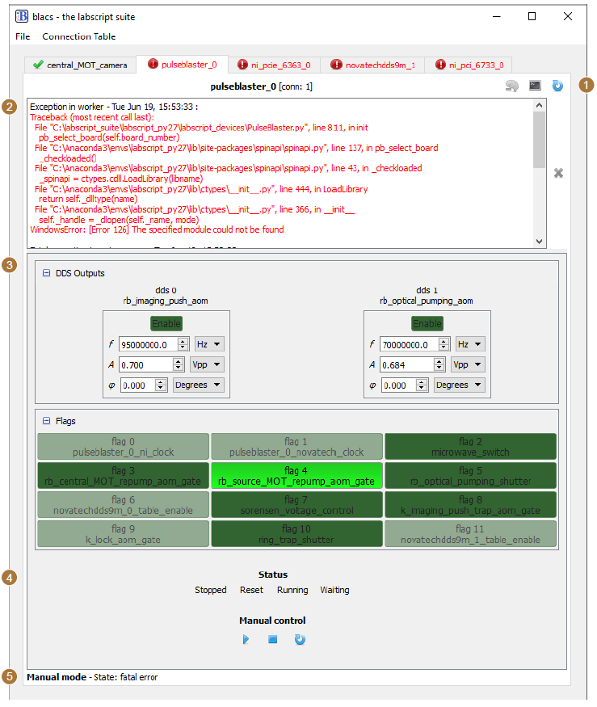
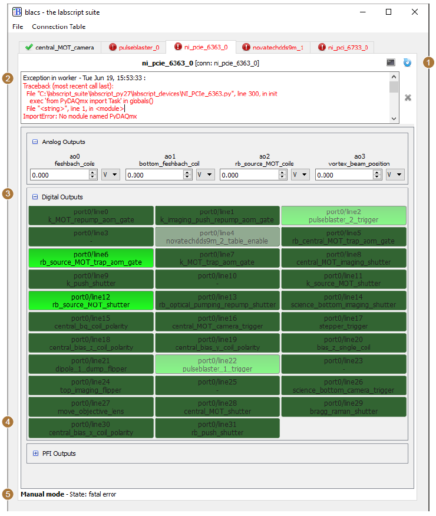
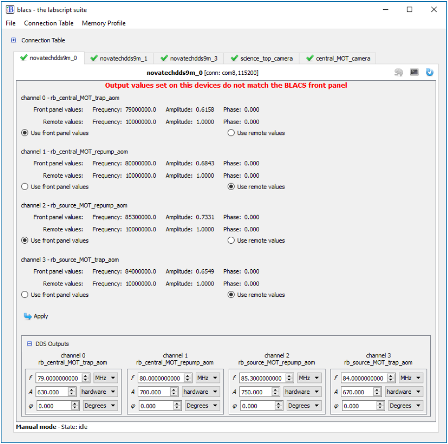
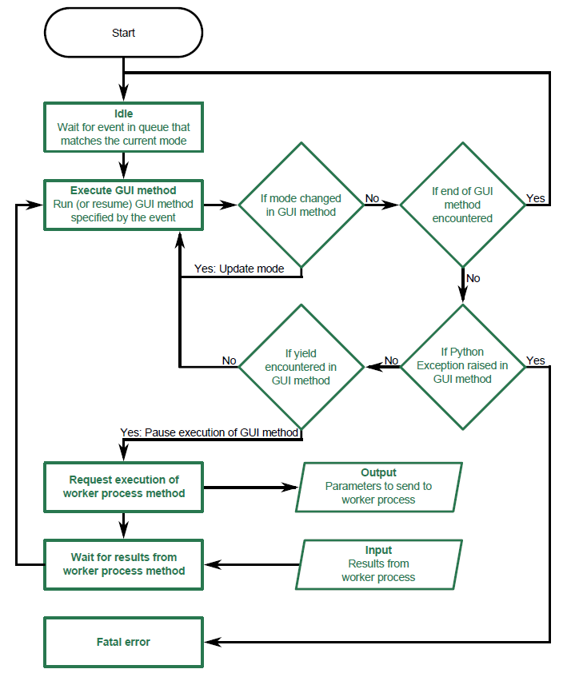

Device Tabs
===========

BLACS creates a tab, in the GUI, for each device it is to control. This information is
sourced from a lab connection table, defined using the labscript API, which is kept up to
date with the current configuration of hardware in the lab. Much of the BLACS GUI is thus
dynamically generated, creating an interface suited to a particular apparatus configuration
rather than enforcing a particular style. These tabs encapsulate three components: the code
that produces the graphical interface, the worker process(es) (which communicate with the
actual hardware), and a state machine which handles communication between the GUI and
the worker process(es).

The graphical interface
-----------------------

Each tab GUI is generated from a set of standard components in order to bring uniformity
to the control of heterogeneous hardware. This also simplifies the process of adding support
for new hardware devices (see :doc:`labscript-devices:adding_devices`) as the author of the device code does not require
knowledge of the GUI widget toolkit. Each tab comprises the following sections (see :numref:`fig-PulseBlaster-Tab` 
and :numref:`fig-PCIe6363-Tab`):

#. device management shortcuts (such as restarting the device),
#. a region (usually hidden) for displaying error messages from the worker process,
#. arrays of ‘manual’ controls for interacting with each of the device’s input and output
   channels when shots are not running,
#. custom controls specific to a particular device (for example status indicators), and
#. the current state of the state machine (see :ref:`device-tabs:State machine`).

.. _fig-PulseBlaster-Tab:

    An example of a BLACS tab for a PulseBlaster DDS-II-300-AWG device. The numbered labels
    match the listing in :ref:`device-tabs:The graphical interface`.

.. _fig-PCIe6363-Tab:

    An example of a BLACS tab for an NI PCIe-6363 device. The numbered labels match the
    listing in :ref:`device-tabs:The graphical interface`.

The most prominent feature is the arrays of manual controls. These are particularly
useful for manual debugging of an experiment apparatus outside of running shots. For
easy identification, each channel is automatically named with both the hardware output
port, and any assigned name from the lab connection table. All analog values also have
an associated dropdown list, where the current unit is displayed. Unit conversions are
automatically determined from the lab connection table (where they are defined using the
labscript API). This makes debugging simpler as you can immediately be sure of
the output quantity in real world units (for example, the strength of a magnetic field). All
output controls can be locked via a right-click context menu to prevent accidental change
of their state, which is particularly important when controlling sensitive equipment that
can be damaged. For analog quantities, the default step size used when incrementing or
decrementing the value [1]_ can also be customised via the right-click context menu.

The values displayed in the manual controls are also coupled to the hardware device
capabilities. The device code that programs the hardware (see worker processes in :ref:`device-tabs:Worker processes`)
has the ability to return a new value for each channel, each time the device is programmed,
allowing the quantised, rounded or coerced value to be returned such that the manual control
faithfully displays the output state. BLACS also provides an architecture to periodically
poll device values for devices that support such queries. This is particularly important for
devices that are not physically restricted to being controlled by a single user (for example,
devices controlled via a web interface) or devices that don’t remember their state after
being power cycled. For such devices, BLACS continually compares the device state with
the values displayed in the GUI. If a difference is detected, BLACS presents the user with
options to select either the device state or the local state on a per output basis (see 
:numref:`fig-monitoring`).

.. _fig-monitoring:

    An example showing how devices in BLACS can monitor the consistency between
    the front panel state and the output of the device (when not running a shot). Here we show a
    Novatech DDS9m device that has just been power cycled, which causes the output states to
    reset to a default setting. BLACS detects an inconsistency between the front panel values of
    BLACS and the output state reported by the device, and presents the GUI pictured above.
    The user can then to choose either use the local or remote value for each output channel.
    Once selected, the front panel values of BLACS are updated to the selected value and the
    device is reprogrammed to match, restoring consistency.

Worker processes
----------------

For each device, BLACS launches at least one separate Python process (a worker process)
for communicating with the hardware. BLACS communicates with the worker process
through our own remote procedure call (RPC) protocol. The python process(es) run a
thin wrapper around a specified Python class, which allows the parent process (in this case
BLACS) to remotely call methods of the class in the worker process. A method in the
worker process is invoked by the tab state machine (see :ref:`device-tabs:State machine`), via a message sent over a
ZMQ socket. The only task of a worker process is to process any data that is sent to it (via
the invocation of one of its methods), interact appropriately with the hardware device(s) it
manages, and return any relevant data to the state machine. A third party software library,
used to interact with a hardware device (typically provided by a hardware manufacturer),
is then only loaded within the isolated worker process. There are several benefits to this
‘sandboxing’ model. Details on writing the
code for a worker process can be found in :doc:`labscript-devices:adding_devices`.

As previously implied, we have implemented the ability for a BLACS device tab to spawn
multiple worker processes. This is particularly useful for devices that handle both inputs
and output, and whose API allows these inputs and outputs to be separated and managed
by separate processes. An example of such a device is a National Instruments acquisition
card such as the NI PCIe-6363. For this device, we spawn three worker processes: the first
handles analog and digital outputs, the second handles analog acquisition and the third
handles monitoring of a counter in order to measure the lengths of any waits.
Multiprocessing also results in a reduction in device programming time prior to the
start of an experiment shot. Most device programming is I/O bound (not limited by the
processing power of the PC). Simultaneously programming all devices used in a shot thus
typically completes in the time it takes to program the longest device (rather than the sum
of all programming times for sequential programming).

State machine
-------------

One of the major changes in BLACS v2.0 (written and released after our paper [2]_ was
published) was the introduction of a more advanced state machine for each device tab. State
machines are an important tool in building complex systems as they enforce a workflow (in
this case, for GUI-hardware interaction) which improves the stability of the control system.
By using a state machine, we enforce control over what actions can be taken at any given
time, improving the robustness of our control software. For example, manual controls on the
BLACS front panel should not be able to control hardware devices that are under precision
timing while executing a shot. A state machine allows such events to either be discarded or
queued until an appropriate time, under a consistent set of easily defined rules.

The aim of this state machine is to manage the execution of the device-specific code
described previously, which falls into the categories of GUI code and worker-process code.
This code exists within Python methods of the device classes,
and so will be referred to in this section as the execution of a ‘GUI method’ and a ‘worker
process method’ respectively. We have implemented a non-standard nested state machine,
for which we will coin the term 2D state machine. It consists of two orthogonal sets of
states (which we term the inner and outer states) which are linked by the device code. This
architecture differs from a standard nested state machine in that it is not hierarchical (events
are not passed to the parent state machine as in the hierarchical finite state machine). Our
implementation is also unique in that the workflow of the inner (dimension of the) state
machine is identical regardless of the outer state.

The outer dimension follows a classical state machine. There are four possible states
(which we call modes to distinguish them from the states on the inner dimension):

* mode_manual,
* mode_transition_to_buffered,
* mode_buffered, and
* mode_transition_to_manual.

These four modes represent the two possible modes of operation for the hardware; manual
control from BLACS or stepping through instructions during execution of an experiment
shot, and the transitions between these modes (where the programming required to change
the mode of the device, for example the programming of hardware instructions, usually
takes place).

The inner dimension of this two-dimensional state machine is similar to the state machine
that existed in BLACS v1.0. There are 5 possible states:

* idle,
* execute (part of) GUI method,
* request execution of worker process method via ZMQ,
* wait for results from worker process method via ZMQ, and
* fatal error.

The inner state machine spends the majority of time in the idle state where it waits for an
event to become available from a queue. Events are typically placed in the queue in response
to user actions (for example clicking one of the manual control buttons), the ‘queue manager’
processing a shot (see :doc:`shot-management`), or the timeout of a timer (for example for regular status checks
of the hardware).

We define GUI methods that may be queued in the inner state by using a Python
decorator, which abstracts away the state machine so that users can call the Python method
as normal and be assured that it will always run as part of the state machine (although this
enforces the requirement that such methods will return immediately and not return a result
to the caller). The decorator itself takes arguments that indicate the modes (of the outer
state machine) that the GUI method is allowed to run in, and whether the method should
remain in the event queue until the outer state machine enters a mode where it can run, or
if it should just be deleted once it reaches the head of the queue. We also provide an option
to only run the most recent entry for a method if duplicate entries for the GUI method
exist in the queue (albeit with different arguments). This is particularly useful for methods
that take a long time to complete but which may be queued up rapidly, for instance a user
rapidly changing output values of a device that is slow to program. An example of how you
might use the state machine is shown in the definition of a GUI method below.

.. code-block:: python

    class MyDevice(blacs.device_base_classes.DeviceTab):
        # only run in MODE_MANUAL and keep the state in the queue until
        # the mode condition is met
        @define_state(MODE_MANUAL, True)
        def transition_to_buffered(self, h5_file, notify_queue):
            # set the mode to MODE_TRANSITION_TO_BUFFERED
            self.mode = MODE_TRANSITION_TO_BUFFERED
            # define the set of arguments and keyword arguments
            # to be passed to the worker processes
            args, kwargs = (h5_file,) , {}
            # Yield to the state machine so that the worker process
            # can be run
            result = yield(self.queue_work(self.primary_worker,
                'transition_to_buffered', *args, **kwargs))
            # check that everything was successful ...
            if result :
                # success !
                # update the mode and notify the caller
                self.mode = MODE_BUFFERED
                notify_queue.put([self.device_name, 'success'])
            else:
                # Failure !
                # notify the caller
                notify_queue.put([self.device_name, 'fail'])
                # queue up a method in the state machine
                # to return to MODE_MANUAL and instruct the
                # worker to program the device ready for
                # manual operation
                self.abort_transition_to_buffered()

        @define_state(MODE_TRANSITION_TO_BUFFERED, False )
        def abort_transition_to_buffered(self):

This is an example of how one might define the GUI method for triggering the programming
of devices so that they are ready for buffered execution of a shot (ready to step
through hardware instructions). The GUI method transition_to_buffered has been decorated
in order to ensure it is only run as part of the state machine, which means the method
will sit in the inner state machine’s event queue until the outer state machine mode is set
to ‘MODE_MANUAL’. When finally executed by the state machine, the method updates
the mode of the outer state machine, and yields to the inner state machine in order to tell a
worker process to transition into buffered mode (which typically involves programming the
table of hardware instructions from the hdf5 shot file). If successful, the outer state machine
mode is updated again and the caller of the method (in this case the ‘Queue Manager’) is
notified of the result. If unsuccessful, we call the abort_transition_to_buffered method
(which is also decorated as a GUI method) which queues up a new event for the inner state
machine. In practice, common functionality like these methods are abstracted away from
the user and contained within the blacs.device_base_classes.DeviceTab class. They
are implemented in a similar (but more generalised) way to the code shown here. For example
transition_to_buffered is actually written to support an arbitrary number of worker
processes. Further information on adding support for new devices (and how to use the state
machine architecture) is included in :doc:`labscript-devices:adding_devices`.

The state machine for each device tab runs in its own thread and follows a well defined
workflow (also shown graphically in figure 6.4) which can be influenced by the device code.
When an event is available in the queue (that can run in the current mode of the outer state
machine), the inner state machine transitions to the ‘execute GUI method’ state, and calls
the Python method that was queued up. As this method likely interacts with the GUI, the
method is executed in the main thread (via a request to the GUI event loop provided by
the Qt widget toolkit). This method executes (temporarily blocking interaction with the
GUI) until it either completes, or hits the yield Python keyword. The yield keyword in
Python returns control of the program to the calling code (in this case our state machine).
The yield keyword also allows the called method to return information to the calling code
(for example the data variable would be returned if called as yield(data)). We utilise this
to allow the GUI method to request that the inner state machine transition through the
inner states relating to the worker process, in this case by calling:

.. code-block:: python

    yield(self.queue_work('worker_name', 'worker_method_name'))

If such a statement is encountered, the inner state machine enters the ‘request execution of
worker method’ state and requests the named worker process execute the named method. It
then immediately transitions to the ‘wait for results from worker’ state. Once results have
been received from the worker process (after it has run the worker method), the inner state
machine re-enters the ‘execute GUI method’ state, passing in the results from the worker
process as the return value of the yield keyword, and continues with the execution of the
GUI method from the point it left. This continues until the execution of the GUI method
is complete, where the state machine then enters the ‘idle’ state again. The exception to
this is if a Python Exception is raised in the GUI method, in which case the state machine
enters the ‘Fatal error’ state. The GUI method may also request a change in the outer state
machine mode, which then determines which events can be processed when the inner state
machine next returns to the ‘Idle’ state.

.. _fig-statemachine:

    A flowchart of the logic for the BLACS state machine as described in :ref:`device-tabs:State machine`.

This results in a flexible state machine architecture that allows the device code to control
some portions of the state machine, while maintaining a fixed state machine structure across
device tabs. By exposing the internals of the state machine only via the BLACS tab GUI
methods, we can abstract away much of the state machine implementation and simplify
the necessary coding skills needed to implement support for new devices. We believe this
is a critical requirement of meeting the flexibility goal of our control system, and further
details on the simplicity of adding support for new devices is discussed in :doc:`labscript-devices:adding_devices`. Our state
machine architecture also allows us to provide a consistent and responsive GUI to a user
by obscuring hardware specific details and offloading these to a separate process.

Handling waits
--------------

In order to use waits, one of the devices in BLACS must monitor
the length of each wait so that a mapping between labscript time and experiment time can
be made. This mapping is then used by analog acquisition devices in BLACS to correctly
break up acquired traces into the requested acquisitions. The length of the wait is also used
in real (software) time by the wait monitor in order to ensure the experiment is not stuck
in a wait forever.

The current wait monitor implementation uses one of the inbuilt counters that are in
many National Instruments acquisition devices, however other implementations are of course
possible if support is added when creating the device classes. At the completion
of an experiment shot, the wait monitor calculates the durations of each wait (based on
data it acquired during the shot) and writes these to the shot file. The wait monitor then
broadcasts a ZMQ event indicating this has been completed. Device code that relies on the
wait information (for example, for breaking up analog acquisitions into the requested set
of traces), waits for this event to be received during the transition to manual mode, before
performing any action. This ensures that the measured lengths of the waits are always
available in the hdf5 file when required.

.. rubric:: Footnotes

.. [1] Incrementing or decrementing the value can be done using the up/down arrows next to the value, the
    mouse scroll wheel, or the arrow keys on the keyboard. The page up/down keys can also be used, which
    will adjust the value by 10 times the step size. This is distinct from typing a value directly into the
    widget, which is not affected by the step size. However both incrementing/decrementing and typing
    a value in will be equally affected by any quantisation demanded by the hardware device, which we
    discuss in the following paragraph.

.. [2] P. T. Starkey, C. J. Billington, S. P. Johnstone, M. Jasperse, K. Helmerson,
    L. D. Turner, and R. P. Anderson. *A scripted control system for autonomous
    hardware-timed experiments* Review of Scientific Instruments **84**, 085111 (2013).
    https://doi.org/10.1063/1.4817213
