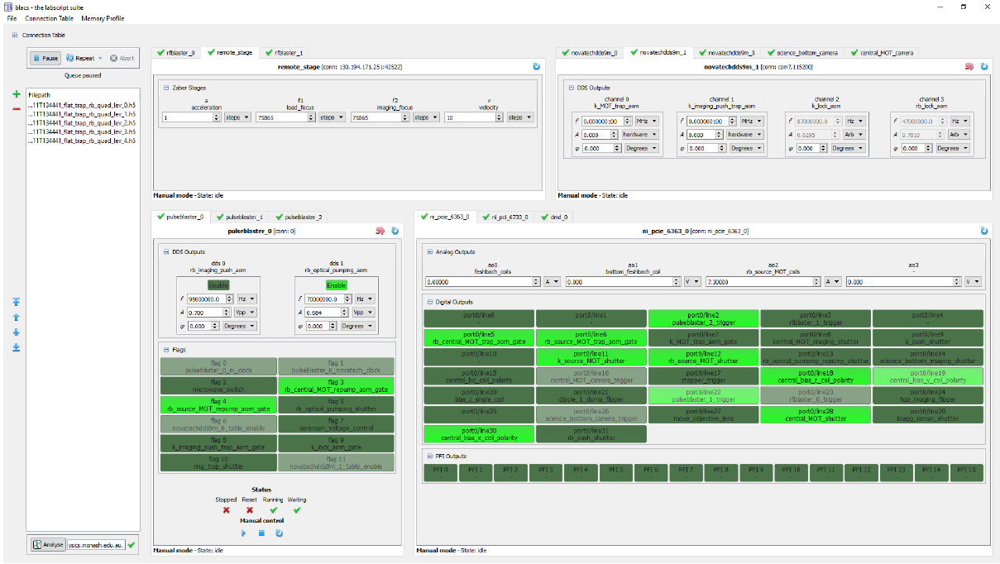

Introduction
============

BLACS interfaces with the hardware devices controlling an experiment, and manages the
queue of shots to execute on the apparatus. BLACS has two modes of operation: the
execution of shots under hardware timing, and the manual control of hardware devices (by
the user) via the BLACS GUI. The interface is shown in :numref:`fig-overview` and is split into two
sections that align with the two modes of operation: the queue of shots to execute, and a
GUI interface for manually controlling the output state of the hardware devices when not
running shots (which can be useful for manual debugging of an apparatus).

.. _fig-overview:

    The BLACS interface. Left: The shot queue. Main: A set of tabs (one for each hardware device) that 
    provide a manual control interface
    for each device. Further details on the BLACS interface can be found in :doc:`usage`.

The shot queue contains standard controls for adding deleting and reordering shots. The
queue can also be paused or put into one of several modes that repeat the shots in the queue.
When a shot finishes, and the results have been saved to the hdf5 file, the shot may be
optionally sent to the lyse server specified in the GUI.

The GUI for each hardware device is dynamically generated at runtime, based on a
connection table written using the labscript API. A device tab is created for each device, and
communicates with a unique worker process which, in turn, handles the communication with
the hardware device. The device tab GUI is populated with controls for each input/output
(IO) channel present. To aid in the identification of a relevant I/O channel, controls are
labelled in BLACS using both the hardware I/O port name and a user specified name from
the connection table of a labscript file. Analog channels (or more complex output types
like a DDS that are represented by several analog numbers) also integrate with the unit
conversions specified in the connection table, allowing both control and the display of units
other than the (device specific) default hardware unit. Channels connected to sensitive
equipment can have the output values limited or the control locked entirely to prevent
accidental changes. Output values are stored on exit, and restored on start-up, to avoid
unexpected output transients.

.. rubric:: Footnotes

.. [1] Documentation taken from Phillip T. Starkey *A software framework for control and automation of precisely timed experiments*
    Thesis, Monash University (2019) https://doi.org/10.26180/5d1db8ffe29ef