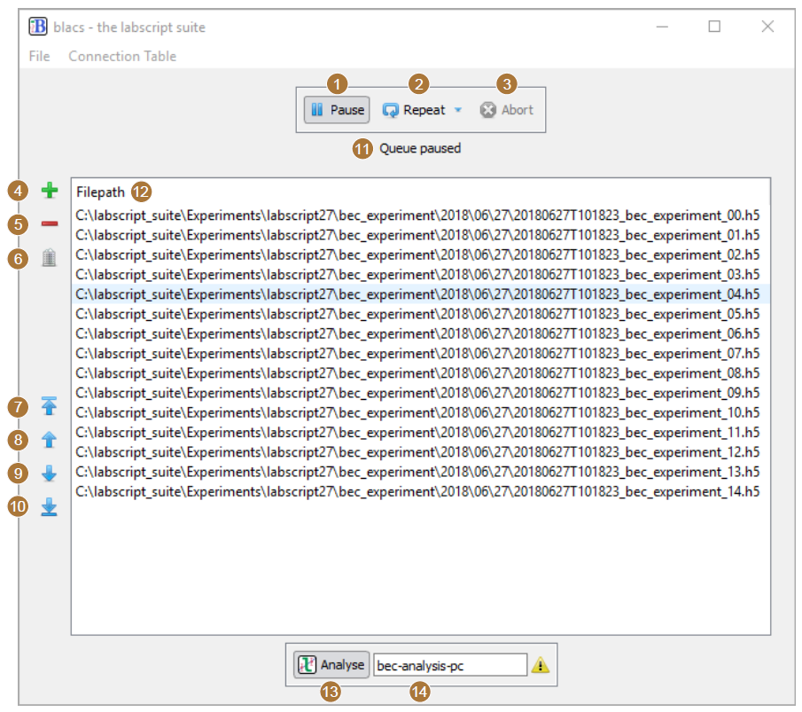
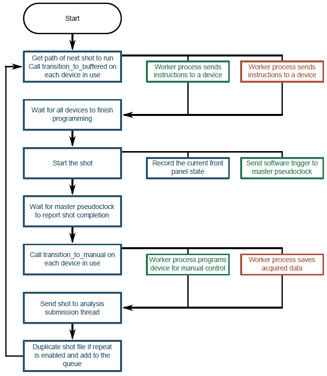

Shot Management
===============

The primary purpose of BLACS is to execute experiment shots on the lab apparatus. File
paths to shots are typically received by BLACS over ZMQ, but can also be loaded directly
through the BLACS GUI (either via the file menu, or by dragging and dropping onto the
queue). Prior to accepting the shot, BLACS compares the connection table of the shot to the
lab connection table and ensures that the shot is compatible with the current configuration of
the laboratory hardware. Connection table compatibility requires that the shot connection
table is a subset of the lab connection table. This ensures that old experiments can not be
run on hardware that is no-longer configured correctly, preventing damage or unexpected
results. Shots that pass this check are added to a queue, which is visible in the BLACS
GUI (see :numref:`fig-queue`).

.. _fig-queue:

    The queue manager GUI within BLACS (with the device tabs hidden). (1)
    The pause button stops the queue from processing new shots (a currently running shot
    will finish). (2) The repeat button, when enabled, will duplicate a completed shot and
    either place the duplicate at the bottom or the top of the queue (depending on the mode
    selected). (3) The abort button immediately stops the execution of the current shot and
    returns hardware to manual mode. (4-5) Buttons to add or delete selected shots from the
    queue. (6) A button to clear the entire queue. (7-10) Buttons to reorder selected shots
    within the queue. (11) The current status of the queue is displayed here. For example, the
    status may indicate that devices are currently being programmed, the master pseudoclock
    has been triggered and the experiment is running, or that acquired data is currently being
    saved into the hdf5 shot file. (12) The list of shot files in the queue, in the order they
    will be executed (the topmost is executed first). (13) A button to enable or disable the
    forwarding of shots to lyse for analysis. (14) The network hostname of the PC running lyse.

The queue is processed by a thread in BLACS, which we term the ‘queue manager’, that
takes the top-most shot in the queue and, in turn, executes it. Shot execution follows the
following pattern (a flowchart of this process is also shown in :numref:`fig-flowchart`):

#.  For each device in use in the shot, a message is sent to the corresponding device tab
    state machine indicating that the device should program the device for hardware timed
    execution of a shot. These messages are sent asynchronously, which ensures devices
    program in parallel if possible (subject to the state machine being available to process
    the message). Included in this message is the path to the hdf5 shot file, which each
    device tab ultimately passes to a worker process that in turn, reads out the hardware
    instructions and programs the hardware. During this programming, the device tab
    enters the mode ‘transition_to_buffered’ (see §6.1.1.3).
#.  The queue manager then waits until all devices have reported they have programmed,
    at which point all device tabs in use should be in the ‘buffered’ state machine mode.
    If a device does not report it has completed within a 5 minute timeout, or a device
    reports an error has occurred during programming, the queue manager aborts the shot
    by pausing the queue, instructing all device tabs to abort, and replacing the shot at
    the top of the queue.
#.  Provided all devices report they are ready, the queue manager proceeds with starting
    the shot. This involves recording the current state of all manual controls (as these usually
    affect the initial values of the shot and may affect results in certain experiments)
    and then instructing the master pseudoclock to begin execution of the programmed
    instructions.
#.  The queue manager then waits for the master pseudoclock to report that the experiment 
    shot has completed. If an error occurs in a device tab during a shot, the queue
    manager aborts the shot (as previously described) and pauses the queue.
#.  Once a shot has completed, the queue manager instructs all device tabs to ‘transition
    to manual’ mode. At this stage, device tabs enter the ‘transition_to_manual’ state
    machine mode where they save any acquired data and reprogram the hardware device
    for manual operation via the BLACS GUI. Again, if errors occur during this process,
    the queue manager aborts the shot as before, but with the additional step of cleaning
    any saved data from the hdf5 file (so that the shot file is returned to the state prior
    to execution).
#.  The path to the shot file is now sent to a separate thread that runs a routine for
    managing submission of shots to lyse for analysis. This routine forwards the shot file
    paths to the lyse server specified in the BLACS GUI if analysis submission is enabled
    (see figure 6.5 (13–14)). If lyse does not respond to these messages, the shot file paths
    are buffered until such time as lyse does respond, to ensure no shots are missing from
    analysis.
#.  Finally, the queue manager checks the state of the repeat button in the BLACS GUI
    and, if required, duplicates the shot (minus the acquired data) and places the duplicate
    in the appropriate place in the queue.

.. _fig-flowchart:

    A flowchart of the logic for the BLACS queue manager. For brevity, we have
    not included the logic for pausing the queue via the GUI or handling error conditions. See
    the listing above for further details.